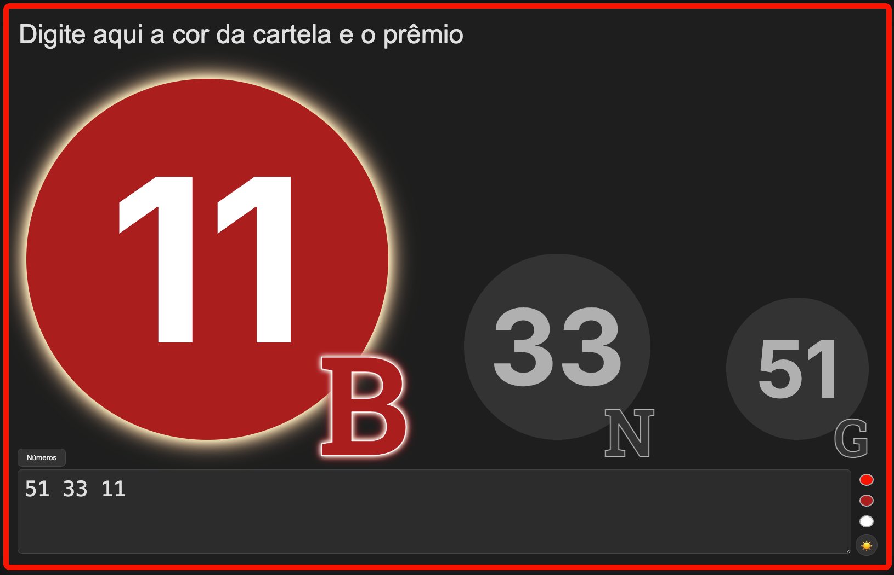

# bingo
App em HTML para acompanhar sorteio de bingos

# Sorteio de Números

Este projeto é uma aplicação web interativa desenvolvida em **HTML5**, **CSS3** e **JavaScript puro** (sem frameworks), com foco em experiência visual e personalização de tema.

A v2 possui um componente frontend (`bingo-v2.html`) e um backend opcional (`bingo-v2.py`) para quem quiser acompanhar o sorteio ao-vivo em múltiplos dispositivos.

## ✨ Função

O objetivo do programa é exibir os últimos três números ou palavras digitados em destaque, dentro de círculos animados, ideal para sorteios, jogos ou dinâmicas em grupo. O usuário pode digitar uma lista de números (ou palavras) e os três últimos aparecem em destaque visual.

## 🖥️ Tecnologias

- **HTML5**: Estrutura da página.
- **CSS3**: Estilização avançada, temas claro/escuro, responsividade e animações.
- **JavaScript**: Manipulação do DOM, lógica de temas, armazenamento local e atualização dinâmica dos círculos.
- **Python (bingo-v2.py)**: Backend HTTP simples para compartilhamento ao vivo dos dados do sorteio.

## ⚙️ Características

- **Tema Claro/Escuro**: Alternância instantânea entre temas, com ícone intuitivo.
- **Personalização de Cores**: Útil se quiser associar com a cor da cartela do bingo
  - Escolha a cor da borda do container principal.
  - Escolha a cor de fundo e da fonte do círculo principal.
  - Cada tema (claro/escuro) pode ter suas próprias cores personalizadas.
- **Persistência**: As escolhas de tema e cores são salvas no navegador (localStorage).
- **Responsivo**: Layout adaptado para desktop, tablets e celulares.
- **Animação**: Círculo principal com efeito de brilho pulsante.
- **Acessibilidade**: Inputs com placeholders e labels.
- **Integração Backend**: Permite enviar o estado do sorteio para um backend Python via POST, possibilitando acompanhamento ao vivo em outros navegadores.

## 🚀 Como usar

### Modo Local (Frontend apenas)
1. **Abra o arquivo `bingo-v2.html` em seu navegador.**
2. Digite números ou palavras no campo "Números".
3. Os três últimos valores digitados aparecerão nos círculos.
4. Use os seletores de cor no topo para personalizar a borda e o círculo principal.
5. Alterne entre tema claro e escuro usando o botão de lua/sol.

### Modo Ao Vivo (Frontend + Backend)
1. **Execute o backend Python:**
   ```bash
   python3 bingo-v2.py
   ```
   O backend ficará disponível em `http://0.0.0.0:8000`.
2. **No frontend (`bingo-v2.html`):**
   - Configure o campo/link da API para apontar para o backend (ex: `http://SEU_IP:8000`).
   - Ao digitar números, o frontend envia automaticamente (via POST) o estado do sorteio para o backend.
3. **Em outros navegadores/dispositivos:**
   - Basta acessar o backend pelo navegador (`http://SEU_IP:8000`) para acompanhar o sorteio ao vivo.
   - A página será atualizada automaticamente a cada 5 segundos.

## 📁 Estrutura

- `bingo-v2.html`: Frontend completo (HTML, CSS, JS) para uso local ou integrado ao backend.
- `bingo-v2.py`: Backend Python (HTTPServer) que recebe POSTs do frontend e serve o estado atual do sorteio.

## 📝 Observações

- Não requer backend para uso local, mas o backend é útil para acompanhamento remoto/ao vivo.
- Todas as preferências são salvas localmente no navegador do usuário.
- O backend é simples e não requer dependências externas.

---

Desenvolvido para ser simples, visual e fácil de personalizar!
